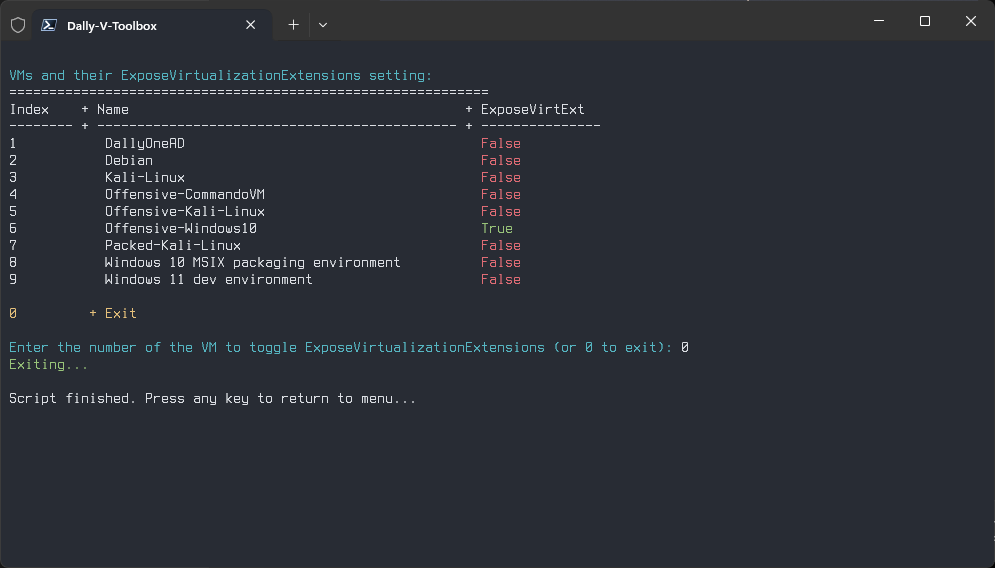

# 

# about-host
Status : currnetly not working as expected

# aboutvmnet
Status:

# client-connect
Status:

# create-VM
Status:

# EnlightenNet
Status:

# NestedVirt
Status:

# sock-type
Status:

# visnet 
Status:
Discription : Lists all hyper-v switches in a list then each switch with all vms connected to that virtual switch
